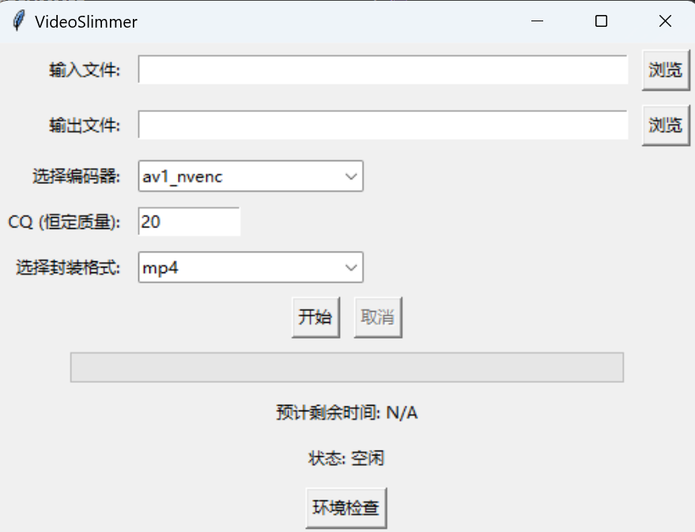

# Easy Video Compressor
一个易于使用的视频压缩工具，提供简单的图形界面，帮助用户轻松压缩视频。功能包括进度显示、预计剩余时间以及取消压缩的能力。旨在简化视频压缩过程，无需处理复杂的命令行命令。


## 特性
🚀 简单易用：无需掌握复杂的命令行，图形界面操作，一键压缩视频。

📊 实时进度显示：显示压缩进度和预计剩余时间，方便掌握压缩进度。

❌ 可取消压缩：提供取消按钮，随时停止压缩过程。

⚙️ 可调节参数：支持设置压缩质量等参数，满足不同质量需求。

💻 硬件加速：利用 NVIDIA 显卡进行硬件加速，获得最佳性能。

## 系统要求
* 操作系统：Windows 或 Linux
* Python：3.x
* FFmpeg：已安装并添加到系统 PATH 中
* NVIDIA 显卡：为了获得最佳性能，需要支持硬件编码的 NVIDIA 显卡
## 安装
1. 克隆仓库

```bash
git clone https://github.com/yourusername/easy-video-compressor.git
```

2. 检查 NVIDIA 显卡和驱动

确保您的系统配备 NVIDIA 显卡，并已安装最新的显卡驱动程序。

## 使用方法
1. 运行程序

```bash
python app.py
```
在图形界面中

* 点击“浏览”选择输入视频文件。
* 点击“浏览”选择输出文件保存位置。
* 设置压缩质量参数（默认 20）, 数字越大视频越小，推荐范围 20-30。
* 点击“开始”按钮开始压缩。
* 在压缩过程中，可以查看进度和预计剩余时间，如有需要可点击“取消”按钮中止压缩。
## 截图


# 重要说明
* **NVIDIA 显卡要求**：本软件利用 FFmpeg 的 av1_nvenc 编码器进行视频压缩，该编码器需要 NVIDIA 显卡的支持。为获得最佳性能，请确保您的计算机配备支持硬件编码的 NVIDIA 显卡。

* **兼容性**：如果没有 NVIDIA 显卡，软件可能无法正常运行，或者性能可能会受到影响。

# 贡献
欢迎提出问题（Issues）和请求（Pull Requests）来改进本项目。
# 鸣谢
* [FFmpeg](https://ffmpeg.org/)
* [Tryanks](https://github.com/Tryanks) 提供ffmpeg指令
# 许可证
MIT License

